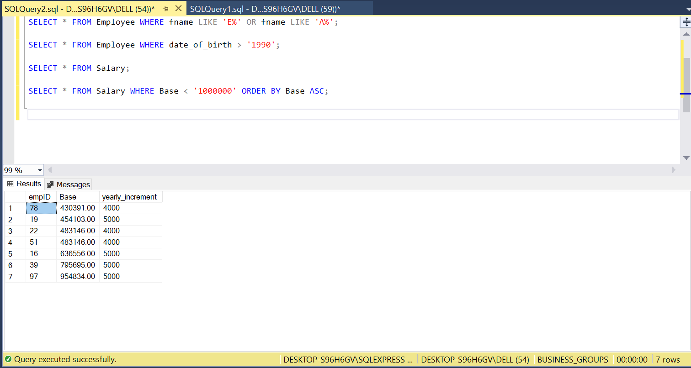

# SQL TASK TWO

## INTRODUCTION

This task will be centered around employees in a fictional business company called Indiah airlines.
Targeting sales performance in previous years alluding areas like Countries, Products, Employee IDs, 
and the likes. This analysis is to drive and compare the company's fundamental business to companies in
the same industry for various financial roles, more attention to specific developments of the employees
and help the company to make imformed decision in the future. 
**_Disclaimer_** : all datasets and reports do not represent any company , institution or country,
just an ordinary datasets to be used for tasks and assignments.

## DATA SET

I was provided with 3 datasets to use for this task, the dataset consist of files in a comma-
seperated values(CSV) format. Each row represents;
- Employee
- Salary
- Department
    
## PROBLEM STATEMENT

1. Select the employee table and show the data where city is Mumbai and Delhi. 
2. Select the employee table where employee first name have both ‘a’ and ‘e’  in them. 
3. Subset the employee table to have employee with date of birth above 1990
4. Subset the salary table to show salaries less than 1 million and sort in an ascending order
5. Modify email column of the employee table to contain just email without ‘@gmail.com’

## CONCEPTS DEMONSTRATED

The following were incoporated-
- Logical operators; LIKE, OR,
- SQL Commands; SELECT, FROM, WHERE, ORDER BY
- Comparison operators; >

## SOLUTION

The database created for this analysis was named 'Business_Groups' using the syntax "CREATE 
DATABASE BUSINESS_GROUPS"
The screenshot displays the database.

---

### 1. Select the employee table and show the data where city is Mumbai and Delhi.

I selected the employee table from the Business_Groups database. In the employee table,
where there is city either as 'mumbai' or 'delhi'. by using OR logical operator.
below is a screenshot of the syntax used and the after result.

---

### 2. Select the employee table where employee first name have both ‘a’ and ‘e’  in them. 

In the same employee table, to show where employee first name both have 'A' and 'E', A 
logical operator WHERE and LIKE was used. Below is a screenshot of the syntax used and 
the after result.

---

### 3. Subset the employee table to have employee with date of birth above 1990.

To know the employees with date of birth above 1990, a comparison operator was used, 
the greater than '>'.Below is a screenshot of the syntax used and 
the after result.    

---

### 4. Subset the salary table to show salaries less than 1 million and sort in an ascending order.

To subset the salary in an ascending order for salaries less than 1 million. 
Below is a screenshot of the syntax used and the after result. 

---

### 5. Modify email column of the employee table to contain just email without ‘@gmail.com’.

Modification of data using the UPDATE and SET command to contain just @gmail.com.
one of my favourites command to use.Below is a screenshot of the syntax used and 
the after result.

---

# CONCLUSION
It is an amazing analysis and i got to experience that feeling of getting better with SQL, 
I now fully know how to use commands, logical and comparison operators to solve complex business problems.

**_THE END_**

